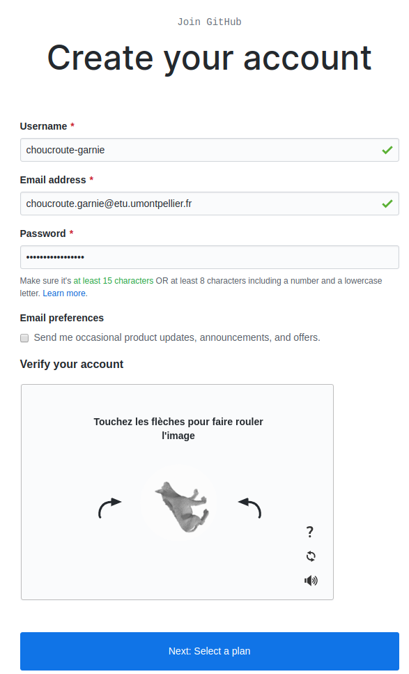
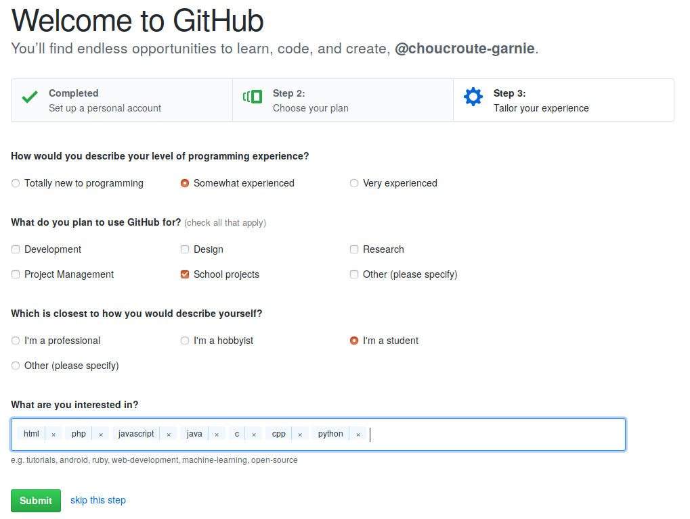

#  Bases de la programmation orientée objet 

### IUT Montpellier-Sète – Département Informatique

* **Cours:** [M2103](http://cache.media.enseignementsup-recherche.gouv.fr/file/25/09/7/PPN_INFORMATIQUE_256097.pdf)
* **Enseignants:** [Marin Bougeret](mailto:marin.bougeret@umontpellier.fr), [Victor Poupet](mailto:victor.poupet@umontpellier.fr), [Sébastien Gagné](mailto:sebastien.gagne@umontpellier.fr), [Petru Valicov](mailto:petru.valicov@umontpellier.fr), [Bruno Yun](mailto:bruno.yun@umontpellier.fr) 
* **Besoin d'aide ?**
    * Le support du cours est disponible [ici](https://github.com/IUTInfoMontp-M2103/Ressources)
    * Le [forum Piazza](https://piazza.com/class/jpv7gf0lltk4kc) de ce cours pour poser vos questions
    * [Email](mailto:petru.valicov@umontpellier.fr) pour une question d'ordre privée, ou pour convenir d'un rendez-vous physique.

## TP 1 : Découverte de Git et premiers code versionnés

L'objectif des deux premiers TPs de ce module est de vous familiariser avec tous les nouveaux outils qui vous aideront durant l'apprentissage du cours. En effet, au délà de la **programmation orientée objets** (l'objectif pédagogique principal du cours), en tant que futur développeur, vous devriez apprendre à être organisé et à collaborer avec d'autres développeurs. Vous apprendrez également à ne pas reinventez la roue : l'informatique est aujourd'hui une science très riche, donc savoir se faire assister par des outils informatique est essentiel. Pour beaucoup d'entre vous ce TP sera la première occasion de se confronter à la [gestion de versions](https://fr.wikipedia.org/wiki/Gestion_de_versions), à l'utilisation d'un [IDE](https://fr.wikipedia.org/wiki/Environnement_de_d%C3%A9veloppement), au [test unitaire](https://fr.wikipedia.org/wiki/Test_unitaire) et à des outils de gestion de cycle de vie logiciel.

### Découverte de Git et préparation de l'environnement

Comme vous allez le découvrir, pour conserver vos réalisations et permettre à votre enseignant de suivre votre 
avancement vous allez apprendre à versionner votre travail avec [Git](https://git-scm.com/) sur la plateforme collaborative [GitHub](https://github.com/). Pendant ce module, 
vous allez principalement écrire du code pour vous-même et qui sera partagé avec vos enseignants. Lorsque vous allez travailler sur le projet à plusieurs vous allez pouvoir mesurer tout le potentiel de [Git](https://git-scm.com/).

#### Création d'un compte Github

Rendez-vous sur la page d'accueil de [github](https://github.com/) :


Cliquer sur "Sign Up" et dans la page qui apparaît, inscrivez votre nom d'utilisateur. Celui-ci il doit être **obligatoirement** composé de votre prénom et de votre nom séparé par le caractère '-'. Si un utilisateur avec ce nom existe déjà, ajouter un chiffre à la fin pour éviter les doublons.
Dans le champs "Email Adress" mettre votre **adresse universitaire**. Attention : il est important que l'adresse soit universitaire afin de pouvoir bénéficier des avantages liés à votre statut d'étudiant. 



Une fois le mot de passe renseigné, cliquer sur le bouton "Create Account". Sur l'écran suivant, vous choisirez l'option de base (qui coûte 0 dollars). Le troisième et dernier écran d'enregistrement vous demande des informations sur votre profil. Indiquer que vous êtes un étudiant et que vous comptez utiliser GitHub pour des projets étudiants :



Une fois ces informations renseignées vous pouvez cliquer sur "Submit" pour définitivement créer votre compte. Ne pas oublier de valider votre adresse email en allant cliquer sur le lien reçu dans votre boîte mail.

#### Paramétrage de votre compte GitHub

Maintenant que votre compte est créé, il faut personnaliser votre profil. GitHub, en plus de vous fournir un moyen simple 
et efficace de conserver votre code en ligne, est aussi un réseau social de développeur. Pour que votre profil puisse 
être valorisé un jour dans votre carrière pro, vous devez correctement renseigner vos informations.

#### Demande du "Student Pack"

Pour terminer la configuration de votre compte, il vous faut demander la remise académique vous permettant de bénéficier 
de dépôts privés et de nombreux autres avantages. Pour ce faire, il faut vous rendre sur la page suivante : https://education.github.com/pack

Cliquer sur le bouton "Get your pack" et certifiez que vous êtes bien un étudiant. Vous vérifierez les informations vous concernant et validerez le formulaire pour terminer cette demande. Généralement la validation de la demande intervient dans l'heure mais il peut arriver que ça puisse prendre plus de temps donc pas d'inquiétude.

#### Prise en main de Git

Pour continuer à prendre en main Git et GitHub, vous allez suivre un tutoriel interactif vous permettant de découvrir 
l'une après l'autre, les possibilités de ces outils. 

Ce tutoriel prend la forme d'une application de bureau appelée **[Git-It](https://github.com/jlord/git-it-electron)**. 
Cette application est multi-plateforme et pourra donc être utilisée indifférement sur les ordinateurs du département ou 
le vôtre. Elle contient des défis pour l'apprentissage, en utilisant vraiment Git et GitHub, pas des émulateurs. 
Vous apprendrez la géniale ligne de commande (et pas si effrayante) et GitHub, ce qui signifie que lorsque 
vous terminerez tous les défis, vous aurez de vrais dépôts sur votre compte GitHub et vos carrés verts comme les grands 
sur votre tableau de contribution.

Télécharger le fichier **"Git-it-Linux-x64.zip"** , le décompacter dans votre répertoire `$HOME` et lancer l'exécutable `Git-it`. Une interface en français est disponible si l'anglais n'est pas votre tasse de thé. La première 
étape du tutoriel (sur la création d'un compte GitHub) peut être passée car vous l'avez déjà réalisée dans la précédente étape du TP.

Une fois le tutoriel terminé, prennez une capture d'écran de la page web intégrant votre contribution et l'envoyer à votre enseignant par mail. Notez que ce sera la dernière fois que vous soumettrez votre travail (ou la preuve de celui-ci) par mail. Désormais tous les TPs se feront en utilisant Git !

Enfin vous pouvez utiliser ce mini [tutoriel](http://pageperso.lif.univ-mrs.fr/~petru.valicov/Cours/M2104/Demarrer%20avec%20Git) qui résume les fonctionnalités principales de Git.


#### Configuration locale de Git

Maintenant que vous avez fait le tutoriel vous pouvez correctement configurer.

Ouvrez le fichier `~/.gitconfig` avec votre éditeur favori et renseignez votre nom, prénom et email dans la 
section `[user]`.
```
# Personnalisez les champs ci-dessous!
[user]
username = choucroute-garnie
name = Choucroute Garnie
email = choucroute.garnie@etu-umontpellier.fr
```

### Création de votre fork du TP1
Maintenant que vous connaissez les bases de Git, vous allez pouvoir commencer à travailler sur vos TP. Désormais le rendu, l'évaluation et le suivi de votre travail passeront par GitHub. La première chose que vous allez donc faire est de créer un fork d'un dépôt. Pour ce faire, rendez-vous sur le lien suivant :

LIEN GITHUB CLASSROOM À METTRE ICI

GitHub va vous créer un dépôt contenant un fork du dépôt 'IUTInfoMontp-m2103/tp1' et s'appellant 'IUTInfoMontp-m2103/tp1-votreUsername'. Ce dépôt sera privé et vous apparaîtrez automatiquement comme contributeur de ce projet pour y pousser votre travail. Les enseignants du module seront automatiquement intégrées en tant que contributeurs également. Cette façon de faire permet à la fois de centraliser et uniformiser les rendus de chaque étudiant et de permettre aux enseignants de suivre plus facilement votre travail. Cela permet également de partager plus facilement une base de code et veiller aux respects des consignes en y intégrant une batterie de tests. Mais cela on le verra plus tard...
Vous allez  cloner le fork GitHub 'IUTInfoMontp-m2103/tp1-votreUsername' sur votre machine et travailler desormais localement tout en "versionant" votre code et en poussant régulièrement vos réalisations.

### À faire pour chaque exercice 
Une fois qu'un exercice sera terminé, n'oubliez pas de pousser vos modifications sur votre fork de la manière suivante (dans cet exemple on suppose que vous êtes sur la branche master) :
```sh
~/tpPOO/tp1-VotreUsername$ git add .
~/tpPOO/tp1-VotreUsername$ git commit -m "Validation de l'exercice 1"
~/tpPOO/tp1-VotreUsername$ git push origin master
```

## Un petit Salut le Monde qui va bien !
### Exercice 1
Dans la méthode principale de la classe `HelloWorld` faites afficher le message "Salut le monde". Dans un terminal, compilez, exécutez, vérifier et versionnez votre travail.

Faites un push sur le dépôt GitHub et comparez avec votre répertoire local. Est-ce que tous les fichiers que vous avez dans votre répertoire local ont été versionnés et pourquoi ?
